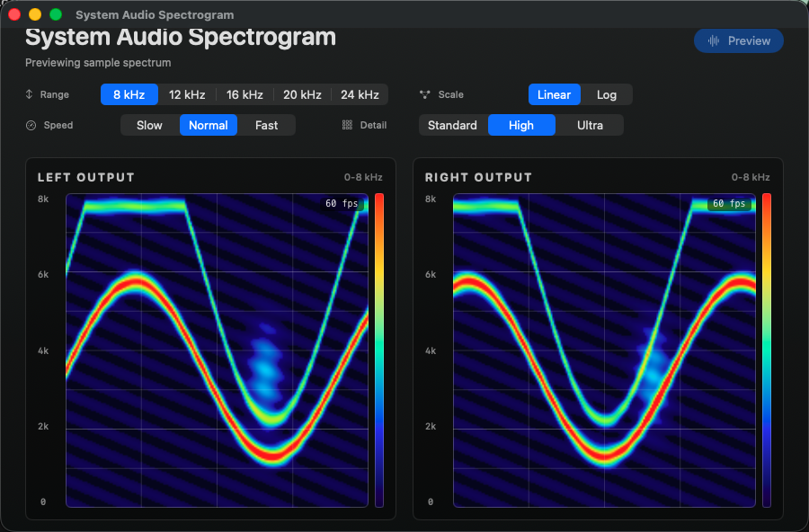

# System Audio Spectrogram

System Audio Spectrogram is a native macOS app that captures the Mac's system output and renders scrolling stereo spectrograms in real time. The interface is dedicated to frequency analysis and includes independent left/right views plus lightweight level readouts.



## Features

- Stereo system-output capture through a Core Audio process tap
- Continuously scrolling spectrograms with stable AppKit/Core Animation rendering
- Selectable 8, 12, 16, 20, or 24 kHz frequency range
- Linear and logarithmic frequency scales
- Slow, normal, and fast history speeds
- Standard, high, and ultra FFT/display resolution presets
- Start/Stop capture control and compact left/right dB readouts
- Local-only analysis with no recording, export, or network code

## Requirements

- macOS 14.2 or later
- Xcode 26.5 or later (verified with Xcode 26.6)

## Build

Open `SystemAudioSpectrogram.xcodeproj` in Xcode and run the `SystemAudioSpectrogram` scheme, or build without code signing from Terminal:

```bash
xcodebuild \
  -project SystemAudioSpectrogram.xcodeproj \
  -scheme SystemAudioSpectrogram \
  -configuration Debug \
  -destination 'platform=macOS' \
  CODE_SIGNING_ALLOWED=NO \
  build
```

Run the unit tests with:

```bash
xcodebuild \
  -project SystemAudioSpectrogram.xcodeproj \
  -scheme SystemAudioSpectrogram \
  -configuration Debug \
  -destination 'platform=macOS' \
  CODE_SIGNING_ALLOWED=NO \
  -only-testing:SystemAudioSpectrogramTests \
  test
```

The project intentionally does not contain a fixed Apple Developer Team. Select your own team in Xcode when a signed local build is needed.

## System audio permission

macOS asks for permission the first time capture starts. If capture is denied, enable the app in System Settings under Privacy & Security, then stop and start capture again.

The app is sandboxed and has only the audio-input entitlement needed by the Core Audio capture path. It does not request file access.

## Privacy

Audio is analyzed locally on the Mac. The application does not record, save, or transmit captured audio.

There is no network client, audio-file writer, or captured-sample persistence in the project. Audio frames are reduced to levels and FFT bins in memory and discarded after visualization.

## Known limitations

- Capture covers the shared system output; individual process selection is not currently exposed.
- Some protected or device-specific audio paths may not be available to a process tap.
- The first public build should still be manually exercised for at least five minutes and checked for clean tap/aggregate-device teardown on the target macOS release.

## License

Released under the MIT License. See [LICENSE](LICENSE).
